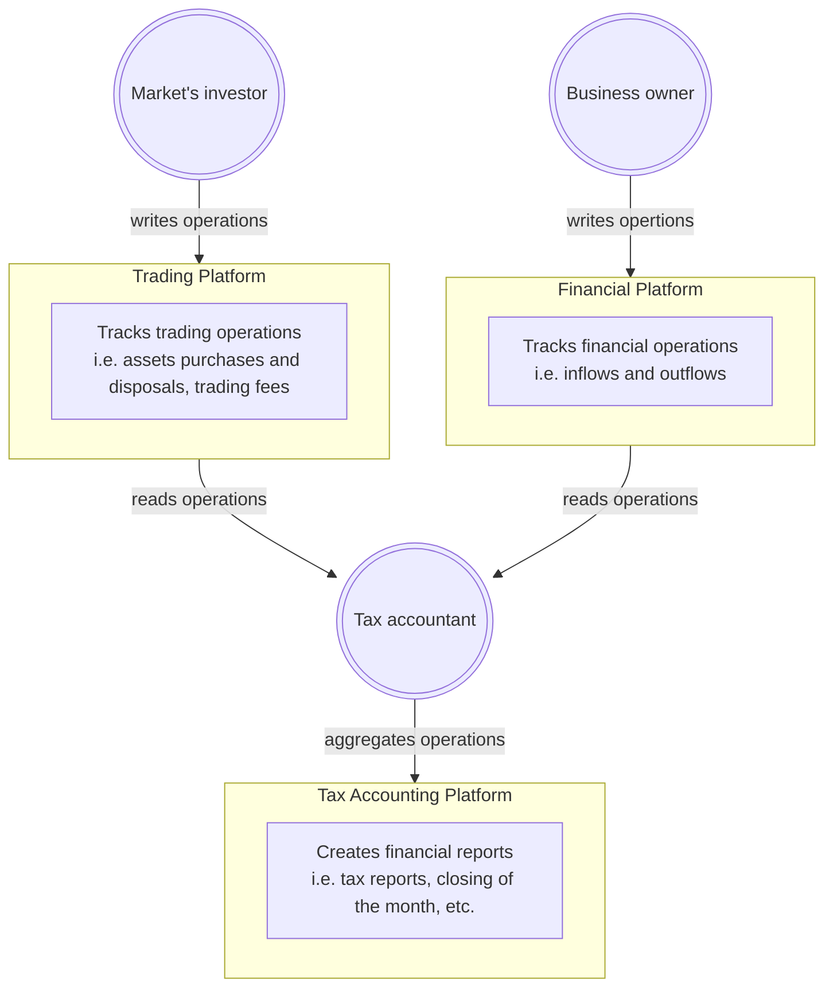
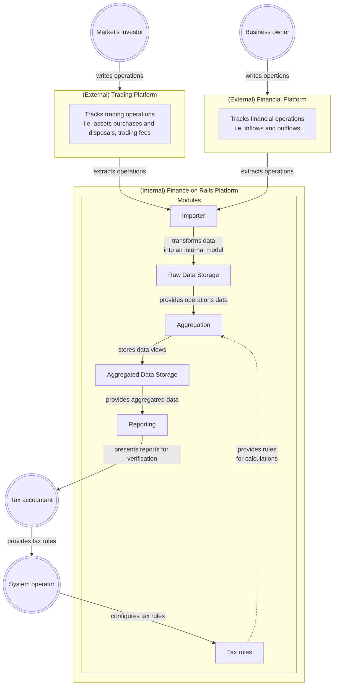

# Delfin

The Delfin software is aiming to solve for processing and tracking for financial transactions of any kind. It makes the reporting for tax purposes easy and accurate, especially in Australian tax jurisdiction.

## Problem

As of now, I have to pull various data reports from trading and financial platforms that I use and have them shared with a tax accounting specialist so they could prepare a tax report for me.

There are various classes of taxable events, but it's not hard to determine which class should be applied to which event. The problem is the vast amount of data that needs to be processed.

## Looking for a solution

That's what I'm trying to address: processing data about financial operations so I could save my time and money (by saving time required for tax accounting).

I'd like to cover at least the areas of:

- sourcing financial data
  - this is where I usually need to grant access to some spreadsheets or other documents presenting all relevant transactions
- storing financial operations and transactions (where a single transaction includes at least one operation)
  - right now, I do that using spreadsheets in the cloud which is a manual and error-prone process
- accounting for inflows and outflows
  - I have to go through all transactions and ensure they have a correct label attached so my accountant knows which tax rulling to apply
- tax reporting for Australian tax law
  - this is where the tax accountant specialst use their tax law knowledge (and usually also their spreadsheet know-how)
  - can be a very costly process and error-prone process — the more transactions the more expensive the process gets, and the longer it is the more errors may show up in the calculations

## Minimal Viable Product

The MVP scope expressed in the [C4 model](https://c4model.com).

### System Context diagram

